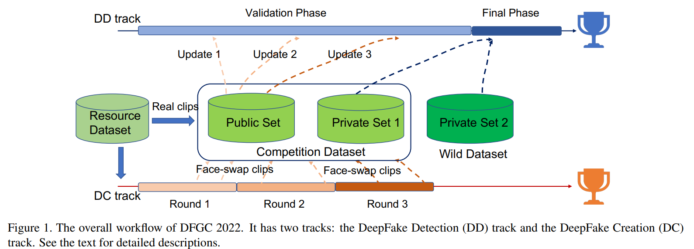
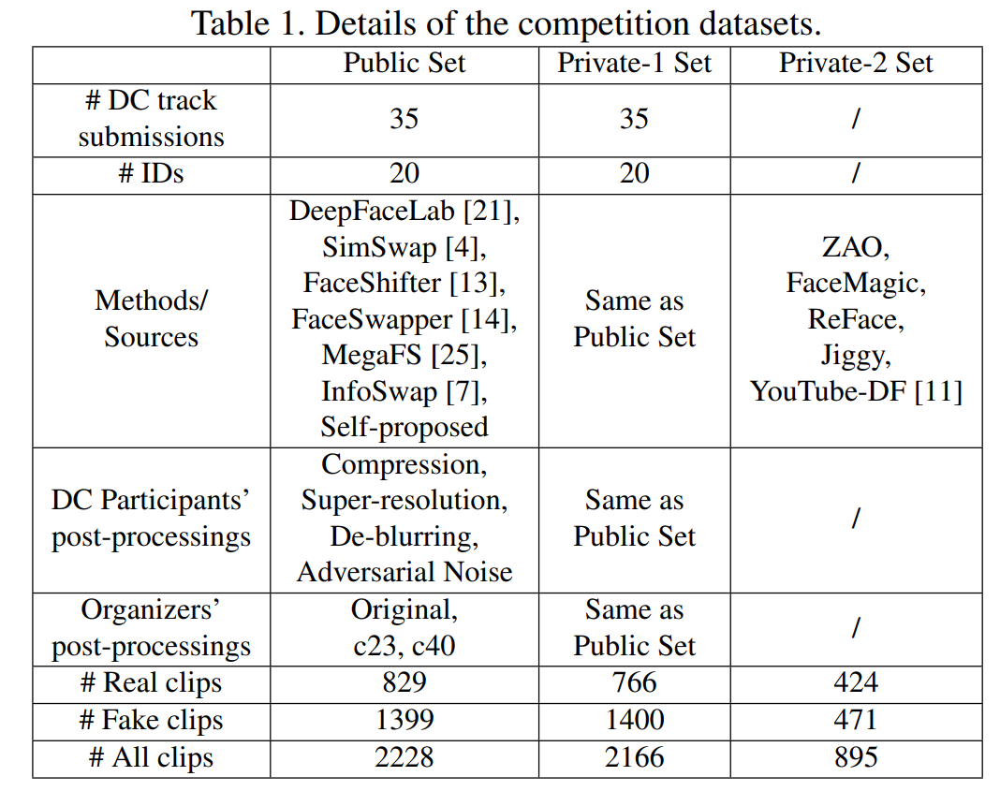
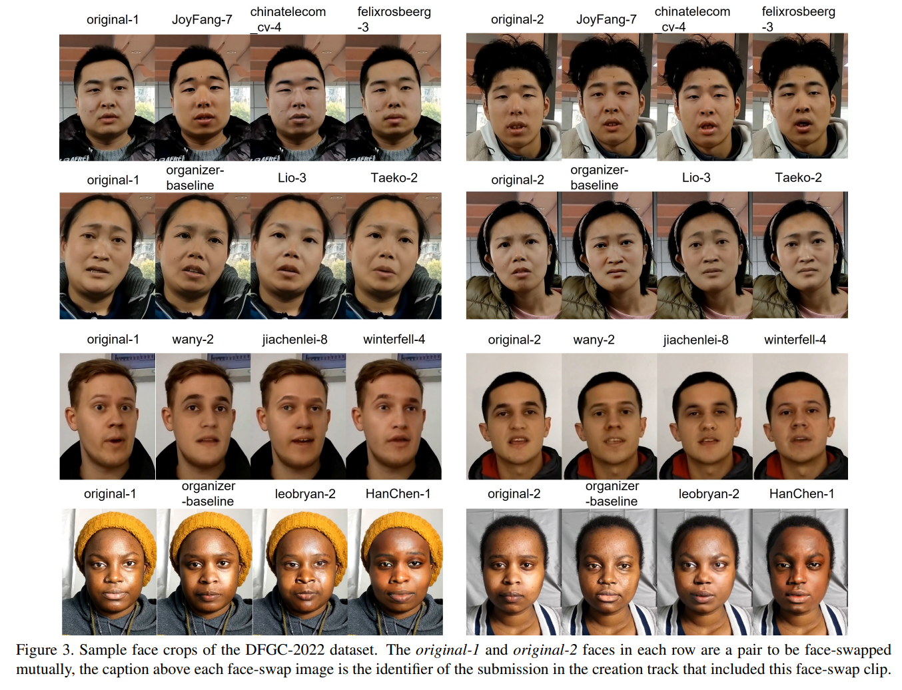

## Overview
The DFGC-2022 dataset originates from [the Second DeepFake Game Competition ](https://codalab.lisn.upsaclay.fr/competitions/2149#learn_the_details-overview) held with IJCB-2022. This competition provides a common platform for benchmarking the game between the current state-of-the-arts in DeepFake creation and detection methods. The overview of the competition and the dataset can be seen in the following figures and tables. We refer to the competition summary paper for more details. **This dataset has 4394 video clips in total, among which 2799 are face-swap DeepFake videos created with various methods, post-processing, and compressions. Researchers in both face-swap and DeepFake detection may find this dataset useful.** 






## Application

The dataset is only for non-profit research usage. Applicants need to agree the terms and sign in the application form ([Google Form](https://forms.gle/kEQD6Q3AxLnXzxRR8) or [Tencent Form](https://wj.qq.com/s2/10464423/105d/)), and cite the following research in order to use this dataset.

@misc{DFGC2022,  
      title={DFGC 2022: The Second DeepFake Game Competition},   
      author={Bo Peng and Wei Xiang and Yue Jiang and Wei Wang and Jing Dong and Zhenan Sun and Zhen Lei and Siwei Lyu},  
      year={2022},  
      eprint={2206.15138},  
      archivePrefix={arXiv},  
      primaryClass={cs.CV}  
}

## The Creation Dataset

It has two sub-folders, *Resource Clips* that include all original clips which are used as resources for creating face-swaps, and *Result Clips* that include all face-swap submissions in the three evaluation rounds of DFGC-2022 creation track.
The *Resource Clips* sub-folder has the following file structure:  ./GroupIndex/ID-Index/ClipIndex.mp4, and it has 20 groups that each containing 2 identities to be mutually face-swapped. The total number of resource clips is 505.

```
Resource Clips  
│
└───1 (Group Index)
│   │
│   └───1 (ID Index)
│   │   │   1.mp4 (Clip Name)
│   │   │   2.mp4
│   │   │   ...
│   │
│   └───2
│       │   1.mp4
│       │   2.mp4
│       │   ...
│   
└─── ...
```

The *Result Clips* sub-folder has the following structure. It has 3 rounds each containing several face-swap submissions from the competition participants or from the organizer baseline. The three txt files *metadata_C1.txt, metadata_C2.txt, metadata_C3.txt* each defines 80 face-swap clips to be made in each submission round. For example, the "1/1/3" means the 3.mp4 of ID-1 in Group-1 needs to be face-swapped (with the ID-2 of Group-1 as the ID donor). 
```
Result Clips  
│   metadata_C1.txt
│   metadata_C2.txt
│   metadata_C3.txt
│   Method Descriptions.xlsx
│
└───Round1 (Round Name)
│   │
│   └───organizer-baseline (Submission Name)
│   │   │
│   │   └───1 (Group Index)
│   │   │   │
│   │   │   └───1 (ID Index)
│   │   │   │   │   3.mp4 (Clip Name)
│   │   │   │   │   7.mp4
│   │   │   │
│   │   │   └───2
│   │   │       │   2.mp4
│   │   │       │   4.mp4
│   │   │
│   │   └─── ...
│   │
│   └───JoyFang-2
│   │   └─── ...
│   └─── ...
│   
└───Round2
│   └─── ...
│
└───Round3
    └─── ...
```
The *Method Descriptions.xlsx* file contains descriptions of face-swap methods used to create each submission. The evaluation results for these face-swap submissions can be seen at https://codalab.lisn.upsaclay.fr/competitions/2149#learn_the_details-evaluation. For example, the 3rd round evaluation results are as follows:

| submission           | realism | mouth | quality | expression | ID    | anti-detection | sum    |
| -------------------- | ------- | ----- | ------- | ---------- | ----- | -------------- | ------ |
| JoyFang (#7)         | 4.04    | 4.095 | 4.16    | 3.89       | 3.6   | 5.04           | 24.825 |
| chinatelecom_cv (#4) | 3.79    | 4.05  | 4.15    | 3.91       | 3.065 | 5.106          | 24.071 |
| JoyFang (#8)         | 3.97    | 4.08  | 3.995   | 3.905      | 3.61  | 4.441          | 24.001 |
| chinatelecom_cv (#5) | 3.555   | 3.925 | 4.075   | 3.815      | 2.96  | 4.895          | 23.225 |
| felixrosberg (#3)    | 3.555   | 3.94  | 3.825   | 3.78       | 3.15  | 4.093          | 22.343 |
| felixrosberg (#2)    | 3.48    | 3.965 | 3.85    | 3.715      | 3.185 | 4.092          | 22.287 |
| organizer-baseline   | 3.79    | 4.015 | 4.03    | 3.88       | 3.84  | 2.625          | 22.18  |
| Lio (#3)             | 3.915   | 4.07  | 3.79    | 3.88       | 3.715 | 2.762          | 22.132 |
| Taeko (#2)           | 3.72    | 3.945 | 3.98    | 3.735      | 3.435 | 3.313          | 22.128 |
| wany (#2)            | 3.955   | 4.055 | 3.7     | 3.88       | 3.625 | 2.695          | 21.91  |
| Lio (#2)             | 3.87    | 4.09  | 3.905   | 3.865      | 3.735 | 2.386          | 21.851 |
| wany (#1)            | 3.96    | 4.085 | 3.905   | 3.885      | 3.62  | 2.329          | 21.784 |
| jiachenlei (#8)      | 2.6     | 3.32  | 3.245   | 3.085      | 2.625 | 2.633          | 17.508 |
| winterfell (#4)      | 3.17    | 3.625 | 3.24    | 3.5        | 2.945 | 0.767          | 17.247 |
| jiachenlei (#7)      | 2.51    | 3.295 | 3.54    | 3.03       | 2.61  | 2.095          | 17.08  |
| winterfell (#5)      | 1.805   | 2.88  | 3.385   | 2.67       | 2.195 | 0.695          | 13.63  |

**The dataset users can compare their face-swap methods with DFGC-2022 participants' methods using this dataset, using your preferred evaluation metrics and evaluation methods.**

## The Detection Dataset
The dataset contains two subsets used in the DFGC-2022 competition: the *Public* set that contains 2228 real and fake video clips, and the *Private* set that contains 2166 video clips. The two sets have disjoint IDs. Here we only release the Private-1 part (described in the competition summary paper), since the Private-2 has copyright restrictions. The ground-truth labels are in *Public Label.json* and *Private Label.json*, where the label 0 represents real and 1 represents fake.

```
Detection Dataset  
│   Public Label.json
│   Private Label.json
│   Detection Dataset Meta.csv
│
└───Public
│   │   aaflfhiktb.mp4
│   │   aapifkmrli.mp4
│   │   abbefwjpxv.mp4
│   │   ...
│   
└───Private
    │   ...
```
The file *Detection Dataset Meta.csv* has detailed meta-information for each clip. This csv file is better  viewed in a plain text viewer, and Microsoft Excel is problematic showing some fields as date format. The meta-information includes "videoName", "label", "split", "target", "compression", "face-swap method". The "target" refers to the original resource video (groupIndex/idIndex/clipIndex) that the fake video originates from, or the groupIndex/idIndex that the real video originates from. Here, a real video may not correspond exactly to a resource video clip, hence we only narrow down to the idIndex. The "compression" refers to the quality of ffmpeg compression we conduct on submitted videos: "c40", "c23", "none" are respectively 
heavy compression, light compression and no compression. The "face-swap method" only applies to fake videos that refers to the submission identifier from the creation track. Refer to the *Result Clips* in the creation dataset.

**The dataset users can use this dataset to train or test their DeepFake detection models or methods.** The DFGC-2022 detection track top-3 performances are as follows:

| Team    | Public | Private-1 | Private-2 | Private | Rank |
| ------- | ------ | --------- | --------- | ------- | ---- |
| HanChen | 0.9521 | 0.9178    | 0.8955    | 0.9085  | 1    |
| OPDAI   | 0.9297 | 0.8836    | 0.8511    | 0.8672  | 2    |
| guanjz  | 0.9483 | 0.911     | 0.7461    | 0.8670  | 3    |

## Related Projects

DFGC-2022 detection track first place solution: https://github.com/chenhanch/DFGC-2022-1st-place

DFGC-2021 starter-kit and released dataset: https://github.com/bomb2peng/DFGC_starterkit
